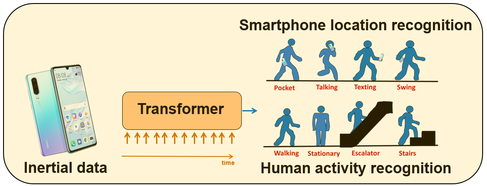

## Inertial-based Activity Recognition with Transformers 
This repository provide the official PyTorch implementation of the method described in the paper: **"Boosting Inertial-based Human Activity Recognition with Transformers"** (Shavit and Klein, 2021, IEEE Open Access). 

We propose a general framework for inertial-based activity recognition with Transformers. 
Samples collected over time with inertial sensors on mobile devices are provided to a Transformer Encoder architecture for learning smartphone location recognition (SLR) and human activity recognition (HAR) tasks. 

The proposed approach is the first to employ Transformers for this task and is shown to provide a consistent improvement, across multiple datasets and scenarios.  


Our model architecture (IMU-Transformer) is shown below:


### Training and Testing for Intertial-based Activity Recognition
This repository supports training and testing of deep learning models for inertial-based activity recognition.
Specifically, these models take IMU data and classify the type of activity. 
We support two models: 
- A Transformer-based classifier (IMU-Transformer)
- A CNN-based (IMU-CNN) classifier, provided for comparison purposes

The entry point to our framework is the script ```main.py```
The frameworks takes in a .csv file, where each row includes a single sample and its associated class.
The samples are then aggregated according to the window size specified in the configuration file.

In order to train a model run:
```
main.py train <path to labels file> 
```
```
python main.py train Dataset/SHAR_train.csv
```

During training, the models and log file will be saved to a dedicated output folder (created if does not exist)

In order to test a trained model:
```
main.py train <path to imu dataset .csv file> --checkpoint_path <path to your model>
```
```
python main.py test Dataset/SHAR_test.csv --checkpoint_path out/run_16_04_25_19_57_final.pth
```

To see the full options, run:
```
main.py -h
```
The different hyper-parameters, including whether to run the Transformer/CNN architectures are controlled by 
the configuration file (```config.json```)

### Configuration Parameters
Parameter Name | Description |
--- | --- |
n_freq_print|How often to print the loss to the log file
n_freq_checkpoint|How often to save a checkpoint
n_workers|Number of workers
device_id|The identifier of the torch device (e.g., cuda:0)
input_dim|The dimension of the input IMU data, e.g., 6 when using accelerometers and gyros
window_size|The size of the time window (i.e. how many samples in a window)
num_classes|Number of classes
window_shift|The window shift, put here the window_size to avoid window overlap
use_baseline|Whether to use the CNN-baseline or not (setting this to False will train the Transformer-based model)
encode_position|Whether to encode positions for IMU-Transformer
transformer_dim|The latent dimension of the Transformer Encoder
nhead|Number of heads for the MHA operation
num_encoder_layers| Number of encoder layers (Transformer)
dim_feedforward:| The latent dimension of the Encoder's MLP
transformer_dropout| The dropout applied to the Transformer
transformer_activation| Activation function used for the Transformer (gelu/relu/elu)
head_activation|Activation function used for the MLP classifier head 
baseline_dropout|Dropout applied for the CNN baseline model 
batch_size| The batch size
lr|The learning rate
weight_decay|The weight decay 
eps| epsilon for Adam optimizer
lr_scheduler_step_size|How often to decay the learning rate
lr_scheduler_gamma|By what factor to decay the learning rate
n_epochs|Number of epochs

